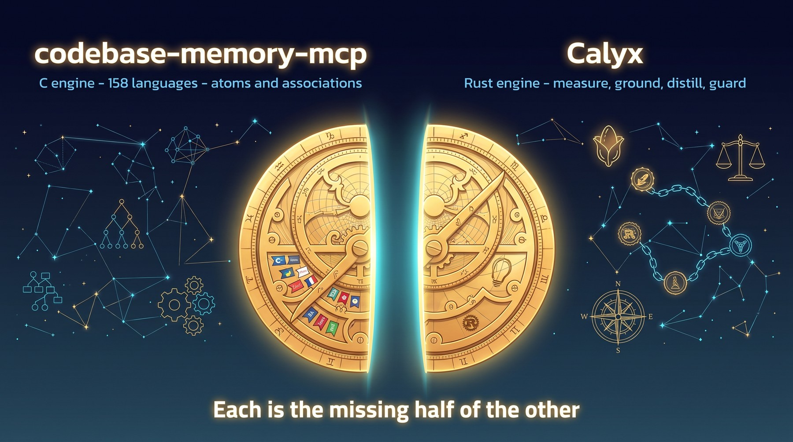
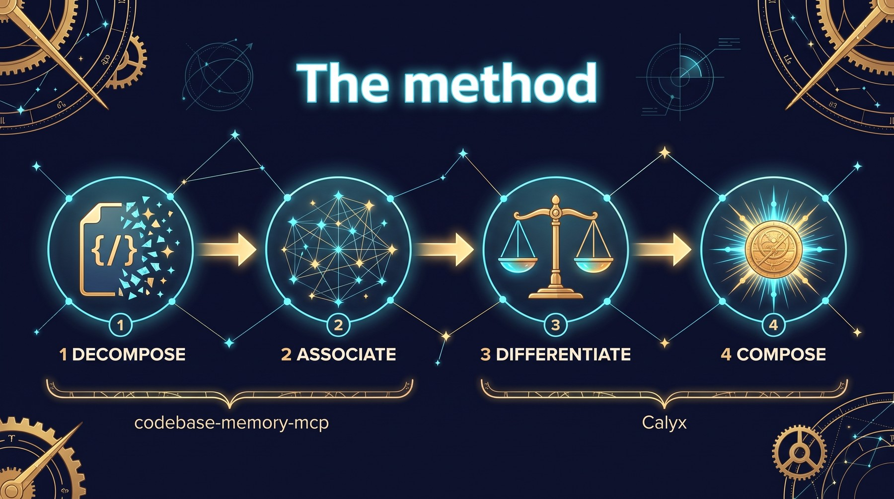
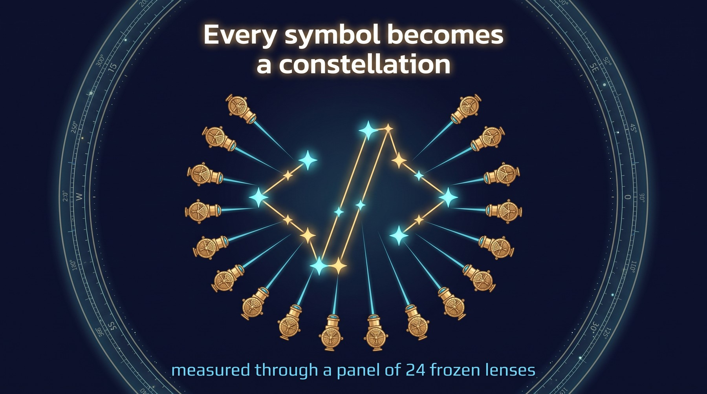
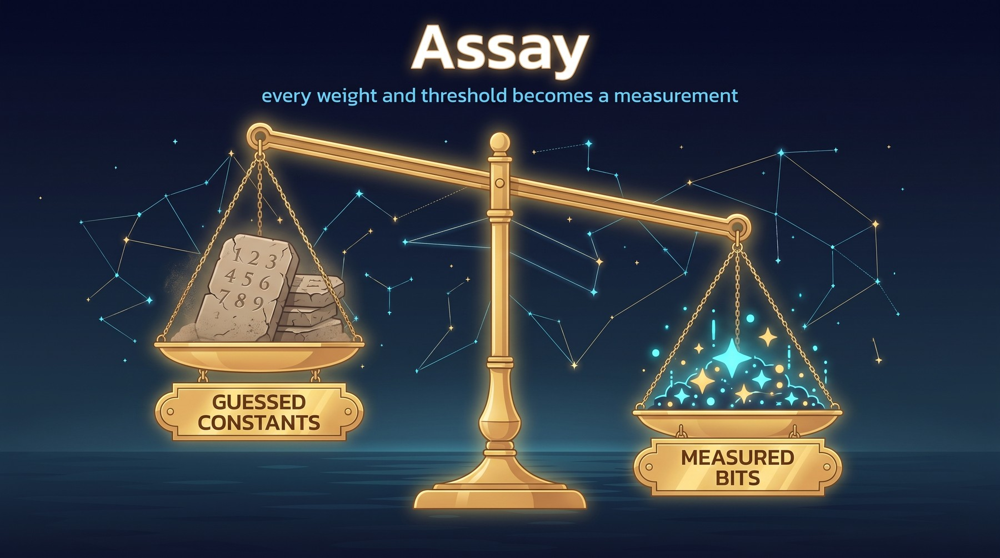
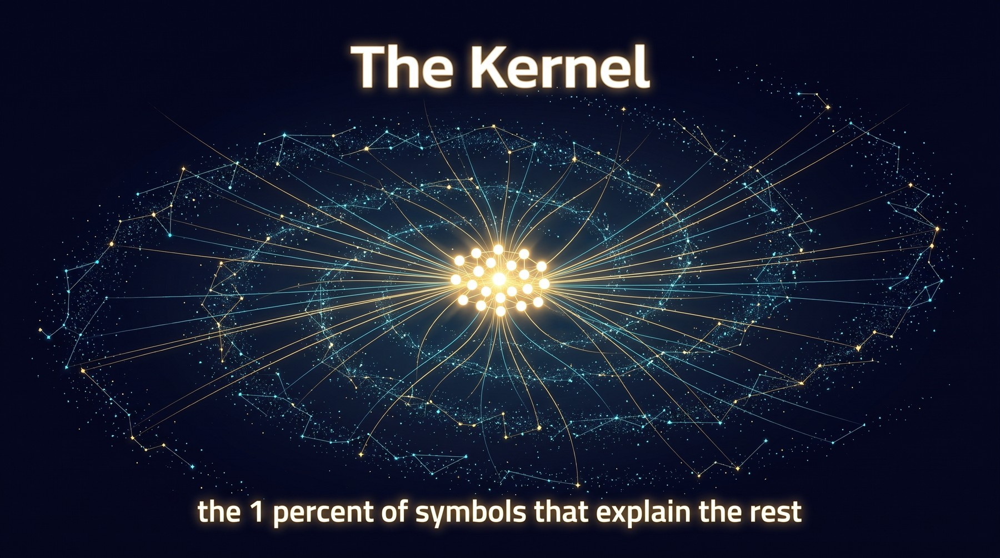
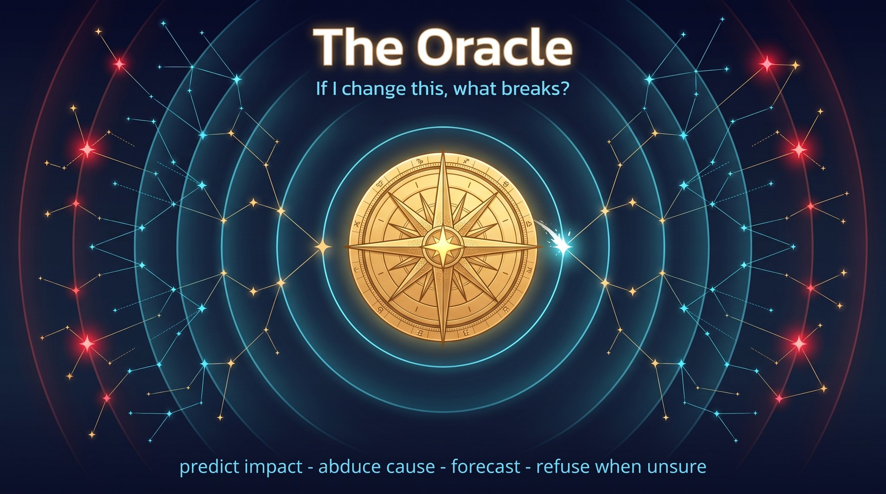
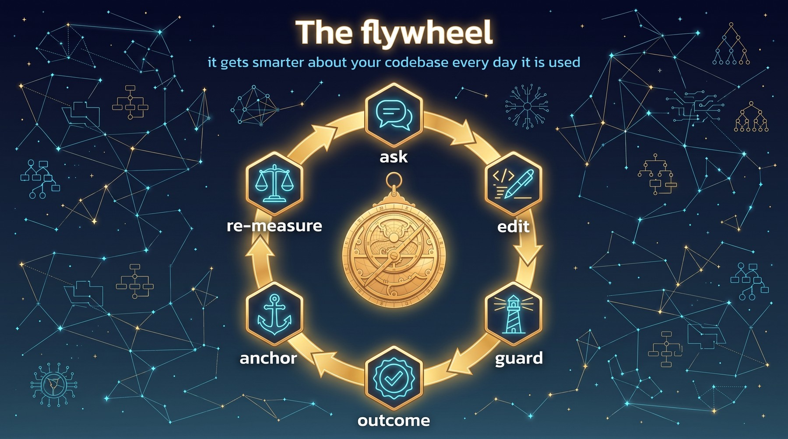
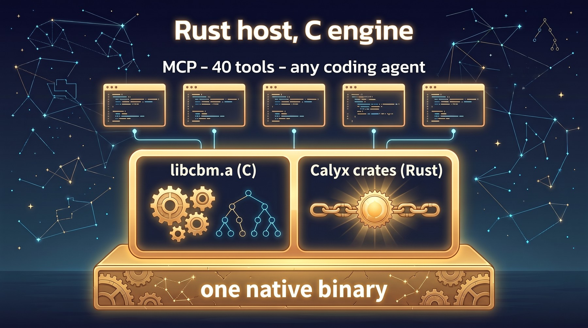
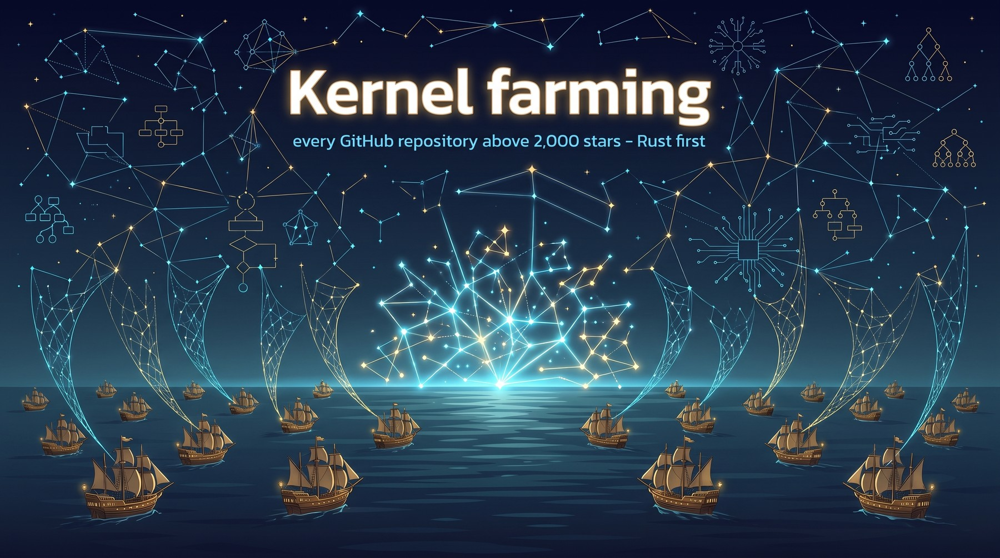

<p align="center">
  
</p>

<h1 align="center">ASTROLABE</h1>

<p align="center">
  <b>The full-state-verification layer for AI coding agents.</b><br>
  A single native MCP server that turns a repository into measured, grounded, distilled, guarded, predictive,
  self-improving intelligence — with provenance for every claim, and a refusal wherever the evidence runs out.
</p>

<p align="center">
  <a href="#chapter-1--a-navigator-with-no-stars">The story</a> ·
  <a href="#the-tool-surface-40-tools">40 tools</a> ·
  <a href="#chapter-14--the-voyage-so-far">Where it stands</a> ·
  <a href="#build-it-yourself-windows">Build it</a> ·
  <a href="#read-these-next">Read more</a>
</p>

<p align="center">
  
  
  
  
  
  
</p>

> **Status, honestly.** ASTROLABE is under heavy, active construction: **1,687 commits and 1,077 tracked issues since July 2026**, most of the intelligence stack live, and the flagship tool still ahead. It is Windows-only by design until the whole system works, it ships no release yet, and it has no test suite by owner directive — every claim below is verified by hand against real bytes on disk. Live project state lives **only** in [GitHub issues](https://github.com/ChrisRoyse/Astrolabe/issues); this README is the story, [EPIC #65](https://github.com/ChrisRoyse/Astrolabe/issues/65) is the truth.

---

## Chapter 1 — A navigator with no stars

<p align="center">
  
</p>

Every AI coding agent today works from **text**. It greps. It reads a file. It infers structure from whatever it happened to open. Its context is a sample, its confidence is uncalibrated, and it has no memory of what was true last week or what actually broke last time.

Even the best open-source code-graph servers — and [codebase-memory-mcp](cbm/) is the best decomposer in the open-source world — stop at the graph. They know *that* `f` calls `g`. They do not know whether that fact ever **mattered**: whether a test ever failed because of it, whether an incident ever traced through it, whether an agent's last change there was reverted. Their weights are hand-set constants, identical for a Haskell compiler and a React storefront. Their thresholds are fixed. Nothing is grounded, nothing is validated, and the system is exactly as smart on day 400 as on day 1.

An agent steering by that graph is a navigator with a map and no stars.

---

## Chapter 2 — Two halves of one instrument

<p align="center">
  
</p>

ASTROLABE begins with an observation: two mature codebases, written independently, are each the missing half of the other.

| | **codebase-memory-mcp** (`cbm/`) | **Calyx** (`calyx/`) |
|---|---|---|
| Language | C — ~120K lines of engine source, single static binary | Rust — ~557K lines across 24 crates |
| What it does | **Decomposes** a repository into atoms and **associates** them: tree-sitter across **158 languages**, a hybrid type-aware LSP reverse-engineered from nine real language servers, **40+ typed edge types** (`CALLS`, `DATA_FLOWS`, `TESTS`, `HTTP_CALLS`, `EMITS`, `CROSS_*`, …), git context, watcher, incremental indexing, a 14-tool MCP surface | An **association-native database and grounded-intelligence engine**: an LSM vault with MVCC time-travel, cross-terms and reactive triggers, mutual-information measurement in bits, kernel distillation, a per-slot conformal guard, a prediction oracle, a hash-chained provenance ledger, and a reversible self-optimizer |
| What it lacks | An intelligence layer: every weight guessed, nothing grounded, nothing improves | A code-domain front end: no parser, no graph extractor, no agent surface |

Neither needed to be rewritten. Both were pulled into this repository **once**, and are now owned, first-class ASTROLABE source — edited directly, evolved in place. There are no pins, no patch overlays, no upstream tracking. The origin repos are, at most, a quarry.

---

## Chapter 3 — The method

<p align="center">
  
</p>

Calyx's builder's handbook ([`docs/BUILDING_ON_CALYX.md`](docs/BUILDING_ON_CALYX.md)) has one foundational rule: *atoms → all base associations → differentiate → kernel → compose; never shortcut it.* CBM already performs the first two steps for the code domain more completely than any hand-built ingestion pipeline in any domain. Calyx is the engine for the last two.

```
codebase-memory-mcp                          Calyx
──────────────────────                       ─────────────────────────
① DECOMPOSE  158-lang tree-sitter      →     measure: every symbol becomes a
             + hybrid LSP → symbols          constellation through a lens panel
② ASSOCIATE  40+ edge types,           →     count: cross-terms, agreement graph
             cross-service, cross-repo,      ③ DIFFERENTIATE  bits, sufficiency,
             git co-change, similarity          redundancy, synergy, causality
                                             ④ COMPOSE  kernel, guard, oracle,
                                                ledger, anneal, fused search
```

> **The thesis in one line:** CBM turns a repository into atoms and associations. Calyx turns atoms and associations into intelligence. Wire the output of the first into the input of the second, ground the result in real developer outcomes, and the loop closes — an MCP that gets measurably smarter about *your* codebase every day it is used.

---

## Chapter 4 — Every symbol becomes a constellation

<p align="center">
  
</p>

The astrolabe is the instrument for navigating by constellations. In ASTROLABE, the atomic record *is* a constellation: every function, class, struct, route, channel and module that CBM extracts is measured through a **panel of ~24 frozen lenses** (`S0`–`S22`) built almost entirely from signals CBM already computes — AST profiles, complexity, MinHash structure, API/type/decorator signatures, error surfaces, git temporal data, graph position — plus a small set of learned embeddings kept strictly separate from the deterministic encoders.

Two identities hold it all together ([`crates/astrolabe-domain`](crates/astrolabe-domain)):

- a **series identity** — the qualified name, stable across versions, and
- a **version identity** (`CxId`) — the content address of *(project, qualified name, canonical source bytes)*, so the same code always yields the same id and a changed byte always yields a new one.

Lens contracts are **frozen**: a lens that changes its shape is a new lens, never a silent edit, so measurements remain comparable across months of history. Anything that tries to violate that is refused with `CALYX_LENS_FROZEN_VIOLATION`.

---

## Chapter 5 — Grounding

<p align="center">
  
</p>

A graph without outcomes is opinion. ASTROLABE attaches **anchors** — real-world outcomes — to real symbols:

| Anchor source | Tool | Trust |
|---|---|---|
| Test-suite reports (`junit_xml`, `cargo_test_json`, `pytest_verbose`, `go_test_json`, `vitest_json`) | `anchor_outcome` | `ci:` sources are **Trusted** (confidence exactly 1.0) |
| Coverage reports (`lcov`, `coverage_py_json`, `cobertura_xml`) mapped line-exact to symbols | `coverage_ingest` | resolved, 1.0; one-hop `TESTS` propagation is proxy, 0.6 |
| Runtime traces (OTLP protobuf / JSON) — production calls promote matching edges to Trusted and flag 5xx incidents | `ingest_traces` | Trusted |
| Git archaeology — SZZ bug-introducing commits, reverts, fix commits | automatic on shadow index | `git:revert:` Trusted; `git:fix:` Provisional |
| AI-agent task outcomes — the flywheel's own feedback | `anchor_outcome` with `agent:` | Provisional |

The trust of an anchor is decided by its source prefix and is **not negotiable**. Every anchor is written to the ledger, and every erasure (`anchor_erase`) is a tombstone plus a ledger entry — append-only physically, destructive to the serving view.

This is the difference between "these two functions look related" and "these two functions have actually broken together before."

---

## Chapter 6 — Assay: bits, not guesses

<p align="center">
  
</p>

CBM's original intelligence layer had an 11-signal semantic score with hand-set weights, fixed thresholds at 0.75 and 0.95, and edge confidences pinned at 0.5 / 0.55 / 0.75 / 0.90 / 0.95 — none measured against anything real, two of the eleven signals dead code.

ASTROLABE's **Assay** ([`crates/astrolabe-assay`](crates/astrolabe-assay), on Calyx's KSG mutual-information estimators) replaces every one of those with a per-repository **measurement in bits**, exposed through `measure_bits`:

- `signals` — bits per lens slot about a real outcome axis, with confidence intervals
- `sufficiency` — *I(panel; axis)* against *H(axis)*: literally "how much of this outcome can our measurements explain, and what is missing"
- `redundancy` — total correlation, effective rank, pairwise map
- `synergy` — three-way interaction information
- `causality` — transfer-entropy `DRIVES` edges with lag sweep
- `calibration` — each edge-resolution strategy's measured precision versus its prior, with Wilson intervals

`assay_gate` then admits, parks or retires candidate lenses from those cards — ledgered and **reversible** byte-for-byte. The standing invariant behind all of it: **no constant that could be a measurement.**

---

## Chapter 7 — The Kernel

<p align="center">
  
</p>

Most of a codebase is explained by a small part of it. The **kernel** ([`crates/astrolabe-kernel`](crates/astrolabe-kernel)) is that part, found rather than guessed: a deterministic full-graph feedback-vertex-set selection with a residual-DAG proof, a complete member index, and a **recall gate** — the kernel must meet an explicitly declared recall threshold (the blueprint's target is ≥ 0.95) against a corpus of real external queries before it is allowed to serve. The threshold is a required admission parameter, not a hidden constant.

- `get_kernel` — build, read, and audit one atomically selected kernel generation; grounding-gap reports name the unanchored regions
- `kernel_answer` — grounded Q&A: resolve an anchored entry point, walk association edges outward with `hop_score = edge_weight × 0.9^hop`, every hop carrying its ledger reference; refuse with a per-lens deficit rather than answer ungrounded

The kernel is the context engine. The flagship product built on it — a token-budgeted, recall-gated, reproducible **context pack** — is the one big piece still ahead (Chapter 16).

---

## Chapter 8 — The Guard

<p align="center">
  
</p>

Before agent-written code lands, the **Guard** ([`crates/astrolabe-guard`](crates/astrolabe-guard), on Calyx's conformal Ward) asks one question: *does this look like the code that works here?*

It measures the candidate on **the same instruments as indexing**, compares it per-slot against kernel-near trusted exemplars (`code_semantic`, `struct_trigrams`, `api_callees`, `name_semantic`, `complexity_profile`, `error_surface`, `public_api_signature`), and combines the per-slot verdicts — never a flattened average — into **`accept` / `new_region` / `quarantine` / `refuse`**, at a calibrated false-accept rate.

The calibration corpus builds itself: `guard_calibrate mode:"generated"` mutates real HEAD source, mines revert records, and borrows alien constellations from other indexed projects, enforcing a mix policy (≥ 50 bad cases, ≥ 3 generators, ≤ 60 % per generator) and failing closed on an under-mixed corpus. No hand-labelled data.

`guard_lock` identity-locks a public API so breaking changes to it refuse; `guard_commit_ood` scores a whole commit; `guard_advisory_hook` is the 300 ms never-blocking fast path for editor hooks.

> What the guard is not: it measures *distributional conformance to trusted exemplars*. It tells you "this does not look like the code that works here." It does not tell you the code is correct — that is what the verification loop (Chapter 12) is for.

---

## Chapter 9 — The Oracle

<p align="center">
  
</p>

CBM's old `detect_changes` mapped hop-distance to risk: one hop away meant CRITICAL. That is topology, not evidence. The **Oracle** ([`crates/astrolabe-oracle`](crates/astrolabe-oracle)) grounds prediction in observed change→outcome history:

| Question | Tool | How it answers |
|---|---|---|
| *If I change X, what breaks?* | `predict_impact` | cycle-guarded butterfly walk over real edges (×0.7 per hop, prune < 0.05, depth ≤ 4), three independent ceilings keeping probability strictly below 1.0; consequences crossing `TESTS` edges become a **ranked test-selection set** |
| *This failed — what most plausibly caused it?* | `abduce_cause` | the same walk backwards; structural-only candidates capped at 0.35 and labelled provisional; every hypothesis names its **disconfirming test** |
| *When will this flaky test bite again?* | `forecast` | median inter-arrival, credible interval, overdue hazard, CUSUM regime changes; refuses on self-inconsistent evidence |
| *Is the system ready for questions about this scope?* | `get_readiness` | a six-tier predicate that fails closed per tier |
| *What are the identifiable causal effects here?* | `causal_analysis`, `expected_gain` | persisted identifiable effects and expected net gains |

And the honesty gate over all of it: a question the panel cannot support is **refused with a deficit**, never answered with a confident guess.

---

## Chapter 10 — Provenance

<p align="center">
  
</p>

Every graph mutation, anchor, kernel build, guard verdict and answer is written to an **append-only BLAKE3 hash-chained ledger** with Merkle checkpoints. Every grounded response carries three labels — `trust`, `freshness`, `provenance` — and an agent is expected to branch on them, not ignore them.

`get_provenance` exposes the chain: `lineage`, `answer_trace` (with legs an answer does not carry reported as explicit unprovenanced warnings rather than fabricated), `verify_chain`, `reproduce` (re-execute a recorded answer with frozen lenses and recorded seeds — an unchanged vault reproduces bit-for-bit; drift beyond 1e-3 fails closed), and `inter_agent_trust` to verify a context pack another agent hands you.

`team_artifact` exports the graph and vault as chain-verified, optionally Ed25519-signed archives, so a second agent or teammate bootstraps in seconds and **verifies before adopting** a single byte.

ASTROLABE is the first coding MCP whose claims an agent — or an auditor — can check instead of believe.

---

## Chapter 11 — The flywheel

<p align="center">
  
</p>

Put the pieces together and something no other coding-assistant substrate has appears:

```
agent asks  →  kernel-ranked, provenanced context
agent edits →  guard validates the diff, per slot, calibrated
tests run, CI passes or fails, PR reviewed, code ships
outcomes become ANCHORS
Assay re-measures bits · kernel re-distills · guard re-calibrates · oracle evidence grows
anneal re-tunes fusion weights, thresholds and quantization — shadow-tested, reversible, tripwired
```

Every unit of real work — a test run, a review, a revert, an agent task — makes the next context better ranked, the next verdict better calibrated, the next prediction better grounded. It compounds because ASTROLABE has all three ingredients at once: **anchors**, **measured bits**, and a **reversible self-optimizer** (`optimizer_status`, with `ASTRO_ANNEAL=0` as a global freeze).

---

## Chapter 12 — How it is built: Rust host, C engine

<p align="center">
  
</p>

One Rust binary ([`crates/astrolabe-server`](crates/astrolabe-server)) embeds the Calyx crates natively and statically links CBM's extraction pipeline as **`libcbm.a`** behind a narrow FFI ([`crates/cbm-sys`](crates/cbm-sys), [`crates/astrolabe-bridge`](crates/astrolabe-bridge)). One allocator topology, one ABI, one process. The Aster vault is the source of truth; SQLite survives only as a regenerable *lowered artifact* so CBM's Cypher engine and 3D graph UI keep working unchanged.

The ASTROLABE-specific glue is **~248K lines of Rust across 15 crates**:

| Crate | Role |
|---|---|
| `astrolabe-domain` | identity spine — canonical input bytes, `CxId` / series |
| `astrolabe-ingest` | CBM → vault import, series registry, projections, ledger verify |
| `astrolabe-lower` | vault → schema-exact lowered SQLite; team artifact |
| `astrolabe-panel` | the code lens panel S0–S22 |
| `astrolabe-weave` | similarity graphs, cross-terms, agreement graph, reactive triggers, anomalies |
| `astrolabe-kernel` | kernel selection, recall gate, bridges, label propagation, skills |
| `astrolabe-anchors` · `astrolabe-assay` · `astrolabe-guard` · `astrolabe-oracle` · `astrolabe-provenance` | grounding, measurement, guard, oracle, ledger surfaces |
| `astrolabe-fleet` | the kernel-farming fleet layer (Chapter 15) |
| `cbm-sys` · `astrolabe-bridge` | FFI to `libcbm.a`; safe wrappers, watcher, tool runner |
| `astrolabe-server` | the MCP surface |

The whole thing installs as the legacy `codebase-memory-mcp` command (a compatibility shim) or as `astrolabe`, over stdio, into Claude Code, Codex, or any MCP client. Every legacy CBM tool keeps working with or without the intelligence layer; `index_repository … calyx:"shadow"` is the one switch that turns the rest on.

### The tool surface: 40 tools

<details>
<summary><b>14 legacy CBM tools</b> — structure and text, behaviour-compatible, several gaining ✨ extensions under the shadow dial</summary>

`index_repository` · `search_graph` ✨ (`fusion`, `fusion_override`, `temporal_alpha_millis`, `propagated_label`) · `query_graph` ✨ (`as_of` time-travel Cypher) · `trace_path` ✨ (`scored` best-first) · `get_code_snippet` · `get_architecture` ✨ · `search_code` · `get_graph_schema` · `detect_changes` ✨ (grounded risk) · `list_projects` · `index_status` ✨ · `delete_project` · `manage_adr` · `ingest_traces`

</details>

<details>
<summary><b>26 ASTROLABE-native tools</b> — grounded intelligence, all requiring a shadow-indexed project and refusing fail-closed otherwise</summary>

| Group | Tools |
|---|---|
| Kernel & context | `get_kernel` · `kernel_answer` |
| Oracle | `predict_impact` · `abduce_cause` · `forecast` · `get_readiness` · `impute_fields` · `causal_analysis` · `expected_gain` |
| Guard | `guard_calibrate` · `guard_check` · `guard_advisory_hook` · `guard_lock` · `guard_commit_ood` |
| Grounding | `anchor_outcome` · `coverage_ingest` · `anchor_erase` |
| Measurement & self-optimization | `measure_bits` · `assay_gate` · `optimizer_status` · `detect_anomalies` |
| Association discovery | `discover_associations` · `discover_latent_links` |
| Similarity, provenance, sharing | `find_similar` · `get_provenance` · `team_artifact` |

</details>

Every tool answers with its trust labels or refuses with a structured `{ code, message, remediation }` — and the `remediation` names the exact next call. The full usage guide, with playbooks for orientation, planning, writing, debugging and review, is [`docs/using-astrolabe-as-a-coding-agent.md`](docs/using-astrolabe-as-a-coding-agent.md).

---

## Chapter 13 — The doctrine: Full State Verification

<p align="center">
  
</p>

This repository is built in an unusual way, and it is deliberate.

**There are no tests. There is no CI. There are no mocks.** Every `#[cfg(test)]` module, every `tests/` directory, the C suite, the gate scripts — all deleted by owner directive, never to be rebuilt. The reasoning is blunt: a passing test proves that a test passed. It does not prove that the artifact works in reality.

What replaces it is **manual Full State Verification**:

1. Build the real artifact, natively, from the canonical checkout.
2. Exercise the real behaviour against real data — this repository's own trees are an always-available corpus.
3. **Independently read back the persisted state** — the bytes on disk, the DB rows, the ledger entries, the process output — and compare it to the claim.
4. Probe the edge cases the same way.
5. Record the command, the execution context, the commit SHA, the artifact hash and the read-back on the driving GitHub issue, and only then check the box.

> *A return value is a claim. The bytes are the verdict.*

The same instinct is baked into the product. The store self-verifies every mutation ([#178](https://github.com/ChrisRoyse/Astrolabe/issues/178)). Every degradation is labelled and every skip counted. Pipeline cost is treated as a correctness property, catalogued as a defect class ([#1064](https://github.com/ChrisRoyse/Astrolabe/issues/1064)). And the whole build runs through a launcher that holds an exact process-identity lease over the tree, freezes it for the duration of an evidence build, and cleans its own output — so no two sessions can quietly destroy each other's evidence.

The six standing invariants, checked on every change — the **HONEST** conjunct:

1. No unlabeled claim. 2. No ungated confidence. 3. No silent fallback. 4. No constant that could be a measurement. 5. State verification over green checkmarks. 6. Production-ready or not merged.

---

## Chapter 14 — The voyage so far

<p align="center">
  
</p>

The blueprint ([`docs/astrolabe-blueprint.md`](docs/astrolabe-blueprint.md), 23 parts) lays out eleven phases on a dependency spine — `P0 → P1 → P2 → (P3 ∥ P4) → P5 → P6 → (P7 ∥ P8) → P9` — each with a falsifiable exit gate. The picture above is atmosphere; the table is the truth, read from the tracker on 2026-09-21:

| Phase | What it delivers | Core spine ([EPIC #65](https://github.com/ChrisRoyse/Astrolabe/issues/65)) | Milestone issues |
|---|---|---|---|
| **P0** Foundations & proof of link | one binary, `libcbm.a`, FFI, unified allocator, pass-through server | ✅ complete | 144 closed / 0 open |
| **P1** Constellations | identity spine, series registry, lens panel, importer, ledger | ✅ complete | 21 / 0 |
| **P2** The graph in the vault | edge import, projections + CSR, lowered SQLite, self-verifying store | ✅ complete | 15 / 0 |
| **P3** Weave & reactivity | similarity graphs, cross-terms, reactive triggers | 3 / 4 — incremental delta path ([#23](https://github.com/ChrisRoyse/Astrolabe/issues/23)) open | 87 / 27 |
| **P4** Grounding | anchors, CI parsers, propagation, SZZ, traces, agent anchors | 5 / 7 — trust lifecycle, flakiness ceilings open | 7 / 2 |
| **P5** Assay | scheduler, KSG MI, redundancy/synergy/TE, calibration, capability gate | ✅ complete | 6 / 1 |
| **P6** Kernel & context packs | kernel pipeline, scoped kernels, gaps, `get_kernel`, `kernel_answer`, provenance | 5 / 9 — **`get_context_pack` ([#41](https://github.com/ChrisRoyse/Astrolabe/issues/41))**, search unification, primary flip open | 19 / 4 |
| **P7** Guard & oracle | calibration corpora, guard, identity-lock, impact, abduction, forecast, honesty gate | 8 / 10 — anomaly completion, label propagation open | 13 / 1 |
| **P8** Self-optimization | anneal loop, knob wiring, lens proposal, mistake closure, readiness | 2 / 11 — the largest core gap | 17 / 10 |
| **P9** Native steady state | streaming FFI, soak, diagnostics, zero-touch verification loop ([#177](https://github.com/ChrisRoyse/Astrolabe/issues/177)) | 5 / 8 | 22 / 9 |
| **KF** Kernel farming | the fleet layer — Chapter 15 | foundation ✅, completion spine open | 59 / 53 |

Across the whole ledger: **1,077 issues filed, 749 closed, 328 open** — 214 ready, 46 in progress, 54 blocked. 233 of the open issues are bugs; 18 are critical. That is a project in the thick of hardening its foundations against reality, not one polishing a release. The most recent wave (August 2026) is a correctness push through the ingestion, weave and kernel core: binding every derived artifact to an exact source generation, proving graph-routed recall on the real graph, and making Leiden clustering complete, deterministic and bounded.

---

## Chapter 15 — Kernel farming

<p align="center">
  
</p>

If one repository yields a kernel, what does *every* repository yield?

[EPIC #461](https://github.com/ChrisRoyse/Astrolabe/issues/461) is the owner's directive to find out: run every GitHub repository above **2,000 stars** through the real repo-to-kernel pipeline, compose an ever-growing **language kernel** — a kernel of kernels — and retire the source only after exact rehydration is proven. Rust first: **1,183 Rust repositories** at that bar (32,580 across all languages), read from the GitHub API on 2026-08-03 as a timestamped observation, not a constant.

The fleet layer ([`crates/astrolabe-fleet`](crates/astrolabe-fleet)) exists and has produced real state on one machine (a Ryzen 9 9950X3D, 125 GiB, RTX 5090):

- a catalog vault, sharded discovery, full-history acquisition, resumable failure-isolated batch orchestration, cross-repository content deduplication, and a continuous growth scheduler — all closed and proven;
- **105 per-repository stores, 116 GB on disk**, from 116 clones;
- a composed fleet kernel `fleet:rust:v1` of **32 repositories / 168 members**, with paired ledger and provenance readback verified.

What stands between here and the full corpus is written down plainly in [`docs/kernel-farm-readiness.md`](docs/kernel-farm-readiness.md): the per-repo pipeline works; the remaining walls are correctness and robustness — total atom-to-lens coverage before mining, abort isolation so one bad file cannot kill a corpus, memory-bounded parallelism, and an atomic, recall-admitted fleet generation ([#1151](https://github.com/ChrisRoyse/Astrolabe/issues/1151)) — before Wave 2 is allowed to start.

---

## Chapter 16 — The flagship is still ahead

<p align="center">
  
</p>

The one-call context assembler — `get_context_pack(task, token_budget)`: a content-hashed, recall-gated, bit-for-bit reproducible pack containing the fix context an agent needs at a fraction of naive file-dump tokens — is the headline product and it is **not built yet** ([#41](https://github.com/ChrisRoyse/Astrolabe/issues/41)). Today an agent composes it by hand: `get_kernel` + `search_graph fusion:true` + `trace_path scored:true` + `get_code_snippet`.

Beyond it, the capstone: the **zero-touch verification loop** ([#177](https://github.com/ChrisRoyse/Astrolabe/issues/177)) — format, lint, compile, exercise the real artifact, read the physical outcome, guard-check, predict impact, anchor the result — run automatically for every agent edit, with refusal on uncertainty. That is the sentence the whole system exists to make true: *the system that tells an agent whether its code works in reality.*

The project's own definition of done, straight from the tracker:

```
ASTROLABE_DONE = LINKED ∧ CONSTELLATED ∧ GROUNDED ∧ MEASURED ∧ DISTILLED
               ∧ GUARDED ∧ PREDICTIVE ∧ PROVENANCED ∧ SELF-OPTIMIZING
               ∧ COMPATIBLE ∧ HONEST
```

Each conjunct is proved only by native manual FSV evidence: real artifact, real data, independent physical readback, edge cases probed. Cross-platform porting is a deliberate final phase, tracked and deferred, started only once Windows works end to end.

---

## Build it yourself (Windows)

<details>
<summary><b>Prerequisites and the launcher</b></summary>

All work runs from the canonical workspace `C:\code\Astrolabe` with native Windows executables. Rust is pinned by `rust-toolchain.toml` (Rust 1.95, edition 2024) with the **`x86_64-pc-windows-gnu` host** — the C half is a static MinGW archive, so Rust and `libcbm.a` must share one ABI; the default MSVC host toolchain cannot perform that link. The C half needs GNU Make, a C/C++ toolchain and libclang for bindgen. WSL may be installed and running; project tooling never detects, blocks on, or modifies it.

Bootstrap the pinned toolchain (GCC 14.1 bundle, LLVM 20.1 analysis bundle, Cppcheck 2.20.0) once:

```powershell
powershell -ExecutionPolicy Bypass -File scripts\windows-gnu-toolchain.ps1 -Issue <driving-issue> -Bootstrap
```

Run every native Cargo or C build **through the launcher**, which selects the matching runtime and pinned analysis tools, confines child `TEMP` to a launcher-owned workspace child, holds the exact-owner lease, and removes its generation and `target/` on exit. Every cargo invocation passes `--locked`:

```powershell
$toolArgs = '["check", "--workspace", "--locked"]'
.\scripts\windows-gnu-toolchain.ps1 -Issue <driving-issue> -Command cargo -CommandArgsJson $toolArgs
```

A contiguous batch is one nested JSON plan owned by one launcher generation:

```powershell
$batch = '[["cargo", "check", "--workspace", "--locked"], ["cargo", "build", "--workspace", "--locked"]]'
.\scripts\windows-gnu-toolchain.ps1 -Issue <driving-issue> -BatchCommandsJson $batch
```

Formatting for the full graph (bare `cargo fmt --all` exceeds the Windows command-line limit on this workspace):

```powershell
python scripts/native-cargo-fmt.py --all -- --check
```

For an artifact that must run after Cargo output is cleaned, stage it during the same launcher lease with `scripts\native-fsv-artifact.ps1` and execute it only through `scripts\native-fsv-run.ps1`. The exact lifecycle, lock discipline and hygiene rules are in [`CLAUDE.md`](CLAUDE.md).

</details>

<details>
<summary><b>Using it from an agent</b></summary>

Connect the binary over stdio as an MCP server, then:

```json
{ "tool": "index_repository",
  "arguments": { "repo_path": "C:/code/my-service", "mode": "full", "calyx": "shadow" } }
```

`calyx:"shadow"` is the master switch. Without it you get plain CBM — a good code graph and nothing else. With it, indexing also builds the vault, the lens measurements, projections, the lowered artifact, provenance, kernel context, anomaly surfaces and git archaeology, and every native tool comes alive. The dial is persisted per project. Then read [`docs/using-astrolabe-as-a-coding-agent.md`](docs/using-astrolabe-as-a-coding-agent.md) — especially §2, the honesty contract, before trusting any answer.

</details>

---

## Read these next

| Document | Role |
|---|---|
| [`docs/astrolabe-blueprint.md`](docs/astrolabe-blueprint.md) | Plan of record — the 23-part design: vision, capability catalog, architecture, data model, lens panel, anchors, weave, assay, kernel, guard, oracle, search, provenance, self-optimization, MCP surface, roadmap |
| [`docs/BUILDING_ON_CALYX.md`](docs/BUILDING_ON_CALYX.md) | Binding doctrine — the Calyx builder's handbook the blueprint derives from |
| [`docs/using-astrolabe-as-a-coding-agent.md`](docs/using-astrolabe-as-a-coding-agent.md) | Usage guide for agents — tools, argument shapes, playbooks, honest limits |
| [`docs/kernel-farm-readiness.md`](docs/kernel-farm-readiness.md) | What stands between here and mining all of GitHub |
| [`docs/status/`](docs/status/) | Point-in-time state snapshots (methodology, delivered, current state, end state) |
| [`CLAUDE.md`](CLAUDE.md) / [`AGENTS.md`](AGENTS.md) | The agent operating manual — mandatory workflow, execution boundary, hygiene |
| [EPIC #65](https://github.com/ChrisRoyse/Astrolabe/issues/65) | Master build tracker — dependency spine, phase checklists, `ASTROLABE_DONE` |
| [EPIC #461](https://github.com/ChrisRoyse/Astrolabe/issues/461) | Kernel farming |
| [#1064](https://github.com/ChrisRoyse/Astrolabe/issues/1064) | Pipeline-cost defect-class catalogue (PC-01 … PC-43) |

## Repository layout

```
crates/            15 ASTROLABE crates (the glue and the intelligence surfaces)
calyx/             Calyx — owned first-class source, 24 crates (Rust)
cbm/               codebase-memory-mcp — owned first-class source (C)
patches/cbm/       ASTROLABE-owned libcbm build glue (Makefile.cbm + ASTRO_* translation units)
scripts/           the native toolchain launcher, FSV artifact/run scripts, recovery transactions
docs/              blueprint, doctrine, usage guide, readiness assessments, status snapshots
```

## License

The ASTROLABE integration code is © 2026 Chris Royse under the combined-distribution grant in [`LICENSE`](LICENSE). Calyx is Business Source License 1.1 standalone, with an ASTROLABE-specific owner grant for the combined distribution. codebase-memory-mcp remains MIT (© 2025 DeusData). Third-party notices are in [`NOTICE`](NOTICE).

---

<p align="center">
  <sub>Illustrations generated for this README with Gemini 3 Pro Image and reviewed by hand. The astrolabe is the instrument for navigating by constellations; this system navigates codebases whose atomic records <i>are</i> constellations.</sub>
</p>
